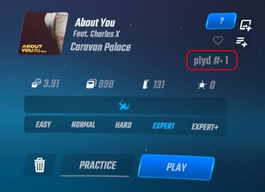

# Simple Beatmap Play Count (Quest version)

Simple mod to keep track of how many times you've played a song.

By default, the count is incremented after reaching 70% through the song.

Differences from the PC version:

- The percentage needed to increment a song's count is hardcoded, and can't be changed recompiling.
- The ▶ icon was stripped away from the in-game font on Quest, so the text says "playd #:" instead.

### TODO

- Use a ▶ image as an icon for the level detail label.

# Data location

Play counts are stored in `/sdcard/ModData/com.beatgames.beatsaber/Mods/BeatmapPlayCount/(Level ID).count`.

## Credits

* [zoller27osu](https://github.com/zoller27osu), [Sc2ad](https://github.com/Sc2ad) and [jakibaki](https://github.com/jakibaki) - [beatsaber-hook](https://github.com/sc2ad/beatsaber-hook)
* [raftario](https://github.com/raftario)
* [Lauriethefish](https://github.com/Lauriethefish), [danrouse](https://github.com/danrouse) and [Bobby Shmurner](https://github.com/BobbyShmurner) for [this template](https://github.com/Lauriethefish/quest-mod-template)
