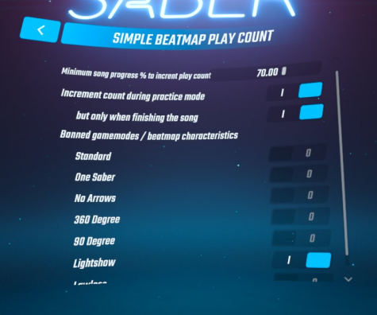

# Simple Beatmap Play Count (Quest version)

Simple mod to keep track of how many times you've played a song.

The count is incremented after playing 70% through a song by default, but this can be configured along other values through an in-game UI:

### TODO

- Only increment play count when the user beats the beatmap
- GitHub CI to build release on every push?

## Installation

1. Make sure your Beat Saber installation [has mod support](https://bsmg.wiki/quest-modding.html) (e.g. setup via BMBF)
2. Follow the steps on the [BSMG wiki to install mods on Quest with or without a PC](https://bsmg.wiki/quest-modding.html#installing-mods)
   - Download the latest .qmod release for your Beat Saber version from [the Releases link on the right](releases/).

### Dependencies

This mod relies Lapiz, QuestUI and ConditionalDependencies.
These dependencies should install automatically when you sync changes in BMBF.

## Data location

Play counts are stored in `/sdcard/ModData/com.beatgames.beatsaber/Mods/BeatmapPlayCount/(Level ID).count`.

Mod configuration is stored in `/sdcard/ModData/com.beatgames.beatsaber/Configs/BeatmapPlayCount.json`.

## Development

Read the [BSMG Wiki Quest Mod Development Intro guide](https://bsmg.wiki/modding/quest-mod-dev-intro.html) to learn how to get your environment setup.

### About mod assets

The [Resources/Bundle.bundle](./BeatmapPlayCount/Resources/Bundle.bundle) file is generated via [a separate Unity project](https://github.com/netux/BeatSaber-BeatmapPlayCount-AssetBundler).

This file is embedded into each release .qmod, so there is no need to download it separately.

## Credits

* [zoller27osu](https://github.com/zoller27osu), [Sc2ad](https://github.com/Sc2ad) and [jakibaki](https://github.com/jakibaki) - [beatsaber-hook](https://github.com/sc2ad/beatsaber-hook)
* [raineio](https://github.com/raineio/Lapiz) - [Lapiz](https://github.com/raineio/Lapiz) (Zenjector)
* [darknight1050](https://github.com/darknight1050) - [QuestUI](https://github.com/darknight1050/QuestUI)
* [raftario](https://github.com/raftario)
* [Lauriethefish](https://github.com/Lauriethefish), [danrouse](https://github.com/danrouse) and [Bobby Shmurner](https://github.com/BobbyShmurner) for [this template](https://github.com/Lauriethefish/quest-mod-template)
